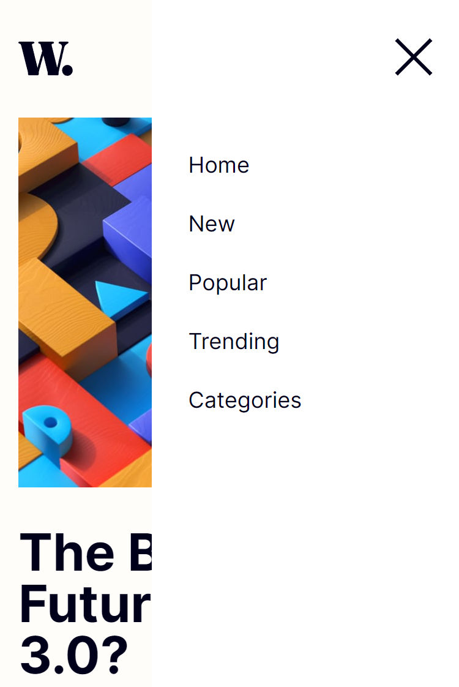
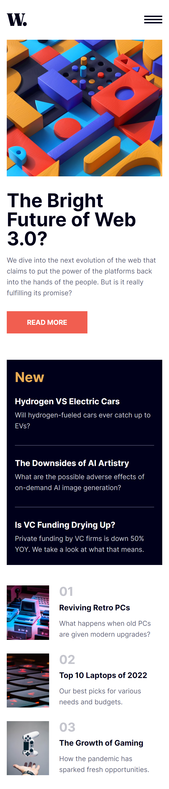
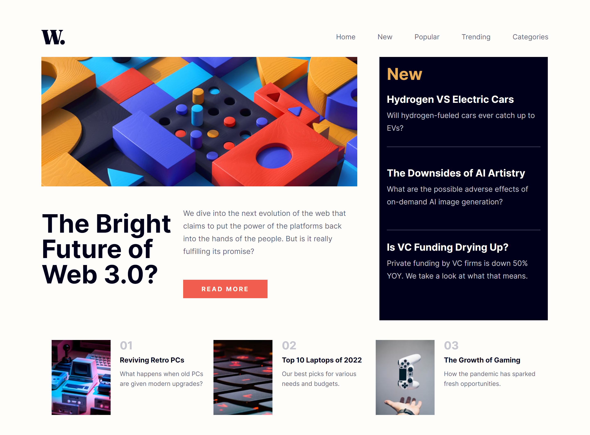

# Frontend Mentor - News Home Page
Projeto de uma home page feita em HTML, CSS e JavaScript, responsiva para mobile (375px) e desktop (1440px)

## Índice

- [Visão geral](#visao-geral)
  - [O Desafio](#o-desafio)
  - [Screenshot](#screenshot)
- [Minha caminhada](#minha-caminhada)
  - [Propriedades](#propriedades)
  - [O que aprendi](#o-que-aprendi)
  - [Recursos](#recursos)
- [Autor](#autor)

## Visão Geral

### O Desafio

Os usuários devem ser capazes de:

- Vizualizar o layout ideal para o site, dependendo do tamanho da tela do dispositivo, mobile (375px) ou desktop (1440px)
- Vizualizar os estados de foco para todos os elementos interativos na página (exclusivos para desktop)

### Screenshots

<html>
    
    
    
</html>

## Minha caminhada

- [x] Preparativos da pagina HTML e CSS para mobile
- [x] Barra de navegação
- [x] Primeira seção: Banner
- [x] Segunda seção: News
- [x] Terceira seção: Top 3 news
- [x] Menu mobile com JavaScript
- [x] Responsividade 1440px

### Propriedades

- Mobile-first
- Semântica HTML
- CSS BEM
- CSS Flexbox
- CSS Grid
- CSS Reaproveitável, limpo e flexível


### Meu aprendizado

Ao longo do projeto precisei elaborar o menu para a versão mobile, e foi imprecindível a utilização de JavaScript, para realizar a abertura e fechamento do elemento de forma dinâmica.

Trechos de destaque:

HTML
```html
<div class="menu__mobile">
    <div class="menu__mobile-icon">
        <button onclick="menuShow()"></button>
    </div>
    <ul class="menu__lista">
        <li class="menu__lista-item"><a href="#">Home</a></li>
        <li class="menu__lista-item"><a href="#">New</a></li>
        <li class="menu__lista-item"><a href="#">Popular</a></li>
        <li class="menu__lista-item"><a href="#">Trending</a></li>
        <li class="menu__lista-item"><a href="#">Categories</a></li>
    </ul>
</div>
```
CSS
```css
.open {
    display: block;
}
```
JavaScript
```javascript
function menuShow(){
    const menuMobile = document.querySelector('.menu__mobile');

    if (menuMobile.classList.contains('open')) {
        menuMobile.classList.remove('open');
        document.querySelector('.icon').src = "img/icon-menu.svg";
    }
    else {
        menuMobile.classList.add('open');
        document.querySelector('.icon').src = "img/icon-menu-close.svg";
    }

}
```

### Recursos

- [JavaScript - Introdução a seletores](https://www.alura.com.br/artigos/capturando-valor-do-input-introducao-a-seletores) - Este é um artigo relevante para quem deseja iniciar seu aprendizado na linguagem.

- [O desafio da Frontend Mentor](https://www.frontendmentor.io/challenges/news-homepage-H6SWTa1MFl) - Neste link você encontrará o desafio que foi solucionado aqui.

## Autor

- LinkedIn - [Pedro A. Lima](https://www.linkedin.com/in/pedrolima626/)
