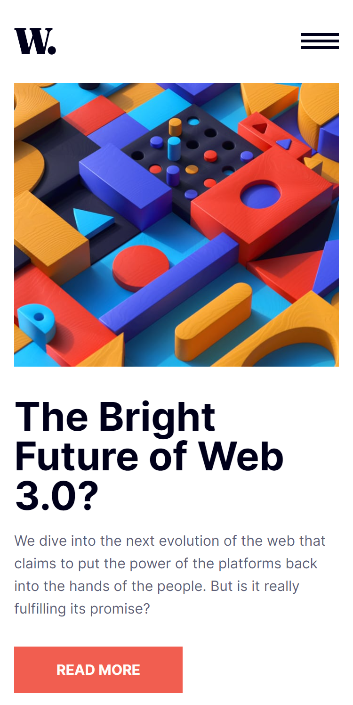

# Frontend Mentor - News Home Page
Projeto de uma home page feita em HTML, CSS e JavaScript.
## Índice

- [Visão geral](#visao-geral)
  - [O Desafio](#o-desafio)
  - [Screenshot](#screenshot)
- [Minha caminhada](#minha-caminhada)
  - [Propriedades](#propriedades)
  - [O que aprendi](#o-que-aprendi)
  - [Recursos](#recursos)
- [Autor](#autor)

## Visão Geral

### O Desafio

Os usuários devem ser capazes de:

- Vizualizar o layout ideal para o site, dependendo do tamanho da tela do dispositivo, mobile(375px) ou desktop(1440px)
- Vizualizar os estados de foco para todos os elementos interativos na página (exclusivos para desktop)

### Screenshot

<html>
    
    
</html>

## Minha caminhada

- [x] Preparativos da pagina HTML e CSS para mobile
- [x] Barra de navegação
- [x] Primeira seção: Banner
- [x] Segunda seção: News
- [x] Terceira seção: Top 3 news
- [ ] Responsividade 1440px
- [x] Menu mobile com JavaScript

### Propriedades

- Mobile-first
- Semântica HTML
- CSS BEM
- CSS Flexbox
- CSS Grid
- CSS Reaproveitável, limpo e flexível


### O que aprendi

Trechos de destaque:

```html
    <div class="menu__mobile-icon">
        <button onclick="menuShow()"></button>
    </div>
```

```javascript
function menuShow(){
    const menuMobile = document.querySelector('.menu__mobile');

    if (menuMobile.classList.contains('open')) {
        menuMobile.classList.remove('open');
        document.querySelector('.icon').src = "img/icon-menu.svg";
    }
    else {
        menuMobile.classList.add('open');
        document.querySelector('.icon').src = "img/icon-menu-close.svg";
    }

}
```

### Recursos

- [?????](https://??????) - Este é um site relevante para quem deseja aprender a propriedade.

- [????](https://?????) - Este é um site que podemos ????.

## Autor

- LinkedIn - [Pedro A. Lima](https://www.linkedin.com/in/pedrolima626/)
